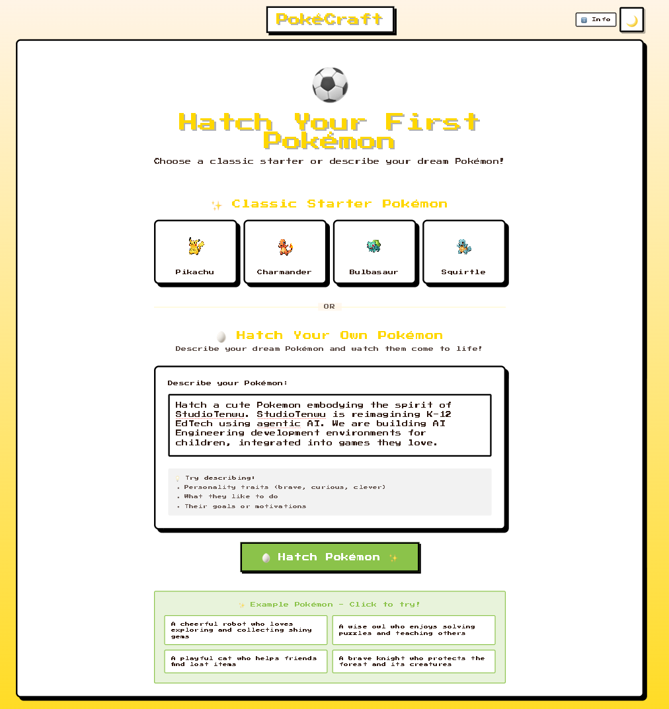
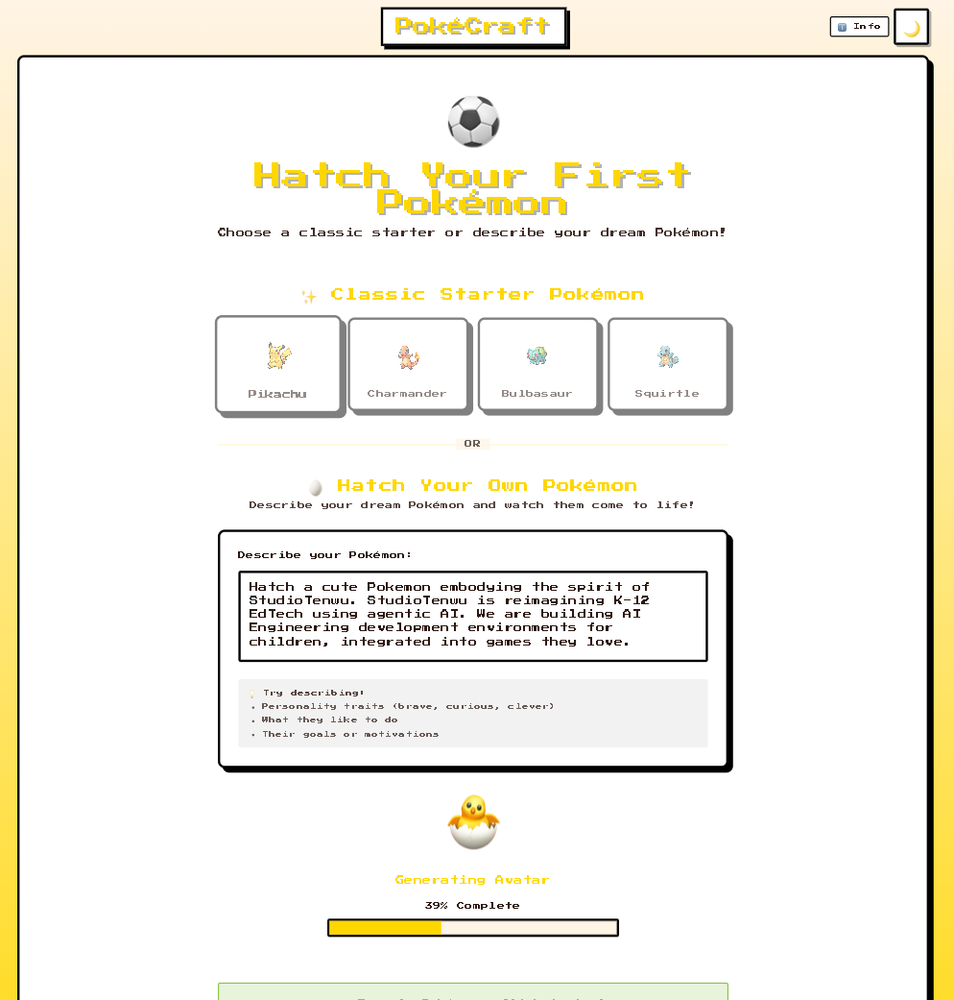
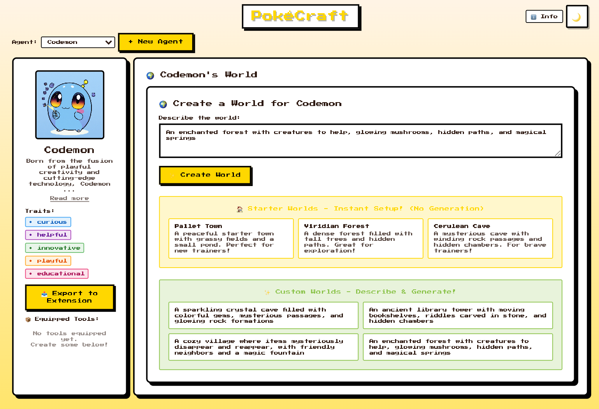
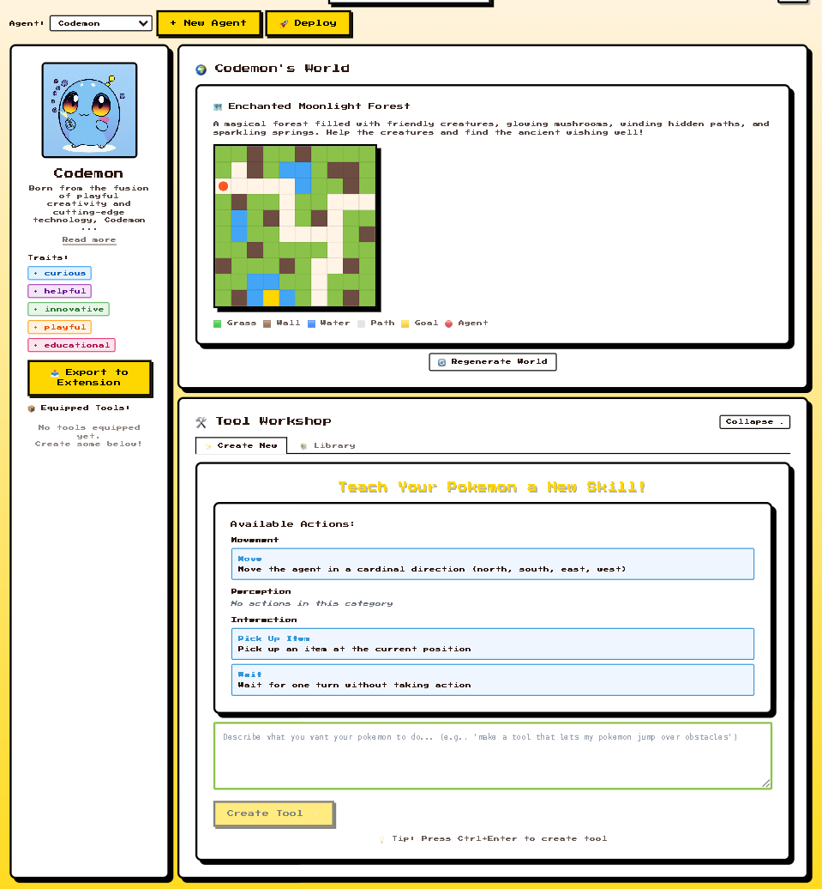
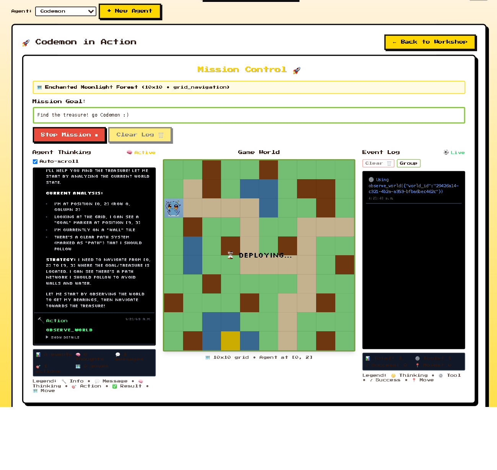

# PokéCraft 🎮

PokéCraft is a game that allows you to create your own Pokémon! You can describe your dream Pokémon, watch them come to life, create a world for your Pokémon, build tools for your Pokémon to survive in the world, and see it move in the world with your tools. Then, you can export your Pokémon into a Chrome extension sidebar, where you can continue chatting with it wherever you are on the web. We hope that you have fun with PokéCraft!

---

## Demos

| Creating Your Pokémon | Hatching Animation | Agent Created |
|:---:|:---:|:---:|
|  |  |  |
| *Describe your dream Pokémon and watch the creation process begin* | *Real-time avatar generation using mflux Schnell 3-bit model* | *Your Pokémon is born with unique personality traits and backstory* |

| World Creation | Tool Workshop | Deployed Pokémon |
|:---:|:---:|:---:|
|  |  |  |
| *LLM-generated 2D worlds with terrain, items, and obstacles* | *Teach your Pokémon custom tools through natural language* | *Watch your Pokémon explore autonomously using the tools you taught them* |

---

## Quick Start

PokéCraft has two parts: **Frontend** (Pokémon creation, world building, tool teaching) and **Chrome Extension** (companion chat sidebar).

### Frontend Setup

**Prerequisites:** Python 3.11+, Node.js 16+, [uv](https://docs.astral.sh/uv/), [mflux](https://github.com/filipstrand/mflux), Flux Schnell 3-bit model

1. **Backend** (Terminal 1):
   ```bash
   cd backend
   uv pip install -e ".[dev]"
   uv run uvicorn src.main:app --reload --host 0.0.0.0 --port 8000
   ```

2. **Frontend** (Terminal 2):
   ```bash
   cd frontend
   npm install
   npm run dev
   ```

3. **Open**: http://localhost:5173

### Chrome Extension Setup

The extension lets you chat with your Pokémon anywhere on the web.

1. **Extension Backend** (Terminal 3):
   ```bash
   cd chrome_extension
   python backend_server.py  # Runs on port 8080
   ```

2. **Install Extension**:
   - Open `chrome://extensions/`
   - Enable **Developer mode**
   - Click **Load unpacked** → Select `chrome_extension/pikachu-extension/`

3. **Export Pokémon**: In the frontend, click **"📤 Export to Extension"** on any Pokémon

4. **Open Extension**: Click the PokéCraft Companion icon → Your Pokémon appears automatically!

---

## Architecture & Documentation

**For detailed information**, see [`.claude/CLAUDE.md`](.claude/CLAUDE.md):
- Complete architecture overview
- Three-phase system (Agent Creation → World Creation → Tool System)
- API reference
- Claude Agent SDK integration
- SSE streaming events
- Database schema
- Testing guidelines
- Development commands
- Troubleshooting

---

## Technologies

- **Frontend**: React 18, Vite, Tailwind CSS, Game Boy Color theme
- **Backend**: FastAPI (async), Claude Agent SDK, SQLAlchemy ORM, mflux (avatar generation)
- **Extension**: Vanilla JavaScript, Chrome Side Panel API, Manifest v3
- **Testing**: pytest (98 tests), vitest (62 tests)

---

## License

MIT

## Credits

Built with [Claude Code](https://claude.ai/code), [Claude](https://claude.ai), [mflux](https://github.com/filipstrand/mflux), [FastAPI](https://fastapi.tiangolo.com/)
